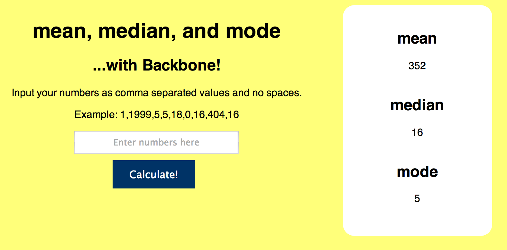

sea-b20-day16hw-MeanMedianModeBackbone
======================================

Mean, Median, and Mode (now with Backbone!)

To test (or use) run server.js and grunt watchForBuild.

Enter numbers as a comma separated list of values, ie:

``` 1,1999,5,5,18,0,16,404,16 ```


